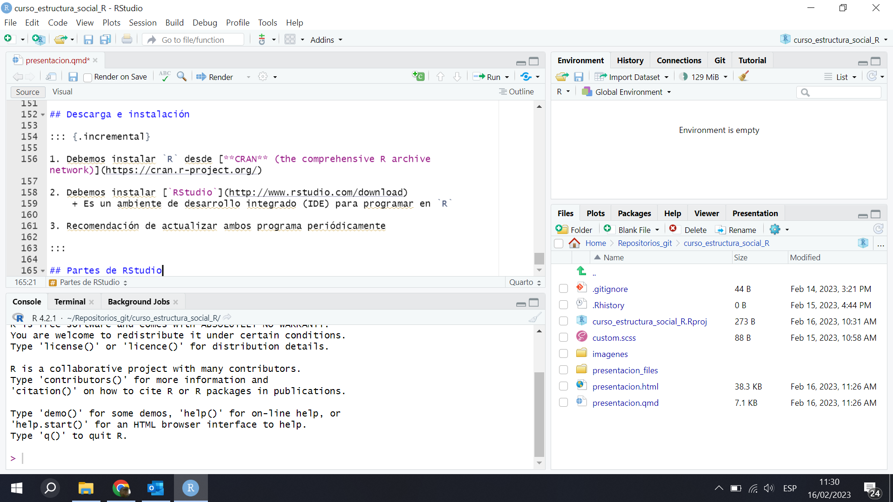
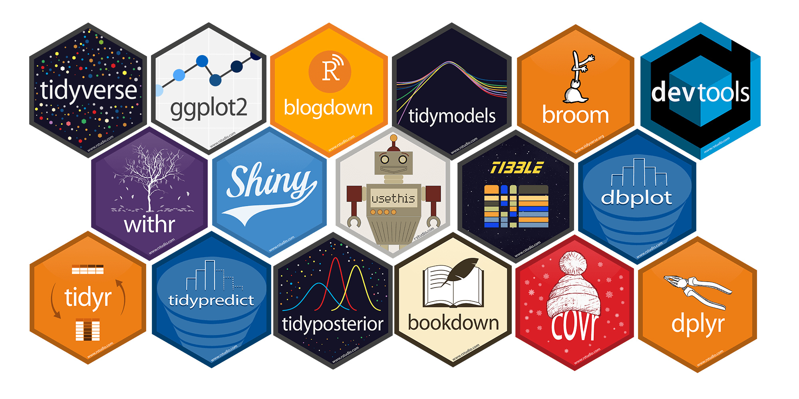
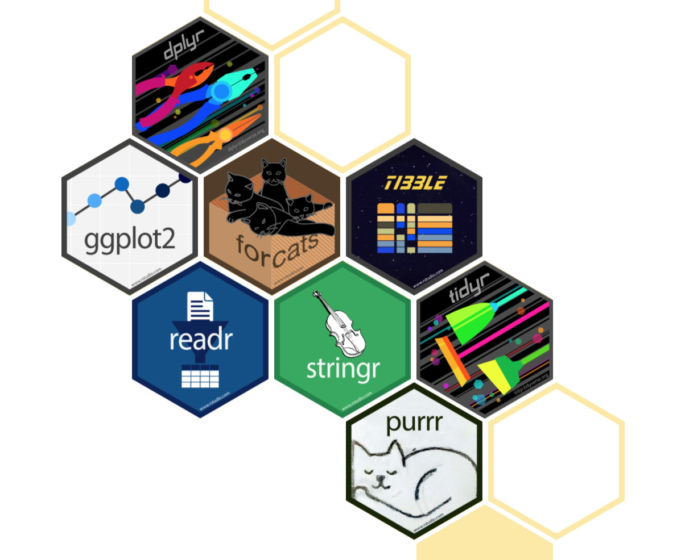
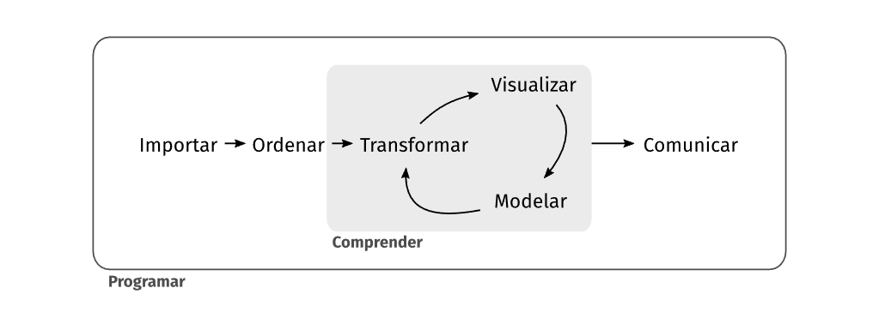
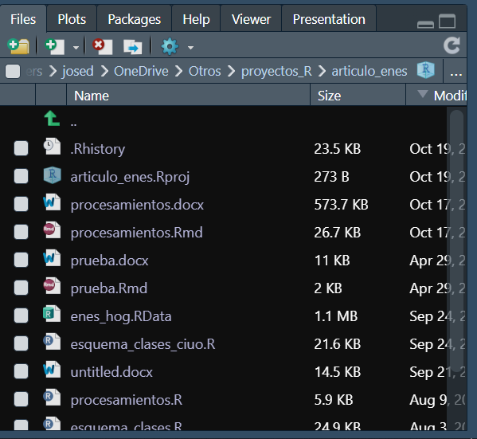
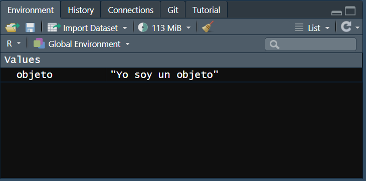
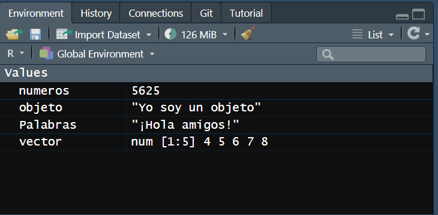

```{r echo=FALSE}
knitr::opts_chunk$set(dev.args = list(png = list(type = "cairo")))
```


## Bibliografía introductoria recomendada  

- [Wickham, Hadley & Grolemund, Garrett (2016). R for data science: Import, tidy, transform, visualize, and model data. O’Reilly Media, Inc. (Capítulo 1)](https://es.r4ds.hadley.nz/){target="_blank"}  

- [Vazquez Brust, Antonio (2021). Ciencia de Datos para Gente Sociable. Una introducción a la exploración, análisis y visualización de datos](https://bitsandbricks.github.io/ciencia_de_datos_gente_sociable/)

- [Sacco, Nicolás; José Rodríguez de la Fuente y Sofía Jaime (2022). Libro de Cocina para el Análisis de las Clases Sociales en Argentina.](https://nsacco.github.io/clases-arg/index.html){target="_blank"}

# 1. ¿Por qué usar `R`? {background-color="#93a1a1"}

## Ventajas

::: {style="font-size: 0.90em"} 
::: incremental
-   Código abierto: amplia cantidad de paquetes
-   Es gratuito
-   Puede abrir varias bases de datos al mismo tiempo: usa la memoria virtual
-   Gran comunidad de usuarios (foros) - **sentido de pertenencia**
-   Uso extendido en la ciencia (sociales) y ámbito profesional
-   Producción de gráficos de alta calidad
-   Capacidad de elaborar tableros, aplicaciones, documentos, páginas web, presentaciones, etc.
-   Compatibilidad con distintas IA (Copilot, ChatGPT, Claude, etc.)
:::
:::

## Desventajas (1)

::: incremental
-   Las órdenes deben darse por sintaxis [(no hay mucho *point and click*)]{style="color:#0E33E9"}
-   Hacer cosas *sencillas* y *rápidas* puede llevar más tiempo que en otros programas
-   La curva de aprendizaje es lenta
:::

## Desventajas (2)

::: {.absolute top="10%" left="5%"}
::: {style="text-align: center"}

:::
:::


## Comparaciones con otros programas  

<br>  


::: {style="font-size: 0.53em"}
+--------------+----------------------+--------------------------+--------------------------+--------------------------+----------------+--------------------------------------------------------------------------------+
| **Software** | **Interfaz**         | **Curva de aprendizaje** | **Manipulación de data** | **Análisis estadístico** | **Gráficos**   | **Especialidades**                                                             |
+==============+======================+==========================+==========================+==========================+================+================================================================================+
| SPSS         | Menus & Sintaxis     | Gradual                  | Moderada                 | Alcance moderado\        | Buenos         | Tablas personalizadas, ANOVA & Análisis multivariado                           |
|              |                      |                          |                          | Baja versatilidad        |                |                                                                                |
+--------------+----------------------+--------------------------+--------------------------+--------------------------+----------------+--------------------------------------------------------------------------------+
| Stata        | Menus & Sintaxis     | Moderado                 | Fuerte                   | Amplio alcance\          | Buenos         | Análisis de panel, Análisis de encuesta & Imputación múltiple                  |
|              |                      |                          |                          | Media versatilidad       |                |                                                                                |
+--------------+----------------------+--------------------------+--------------------------+--------------------------+----------------+--------------------------------------------------------------------------------+
| R            | Sintaxis             | Empinada                 | Muy fuerte               | Muy amplio alcance\      | Excelentes     | Paquetes de gráficos, Web Scraping, Machine Learning & Predictive Modeling     |
|              |                      |                          |                          | Alta versatilidad        |                |                                                                                |
+--------------+----------------------+--------------------------+--------------------------+--------------------------+----------------+--------------------------------------------------------------------------------+

Fuente: <https://sites.google.com/a/nyu.edu/statistical-software-guide/summary>
:::

## Ejemplos de usos de R en el ámbito público y académico  

- [Tableros y reportes del SINTA ](https://tableros.yvera.tur.ar/){target="_blank"}

- [Tablero interactivo de indicadores sobre VIH, ITS, hepatitis virales y tuberculosis](https://www.argentina.gob.ar/salud/vih-its/tablero){target="_blank"}

- [Sacco, Nicolás; José Rodríguez de la Fuente y Sofía Jaime (2022). Libro de Cocina para el Análisis de las Clases Sociales en Argentina.](https://nsacco.github.io/clases-arg/index.html){target="_blank"}

- [Portal de difusión de datos del CEPED](https://ceped-data.shinyapps.io/ceped-data/){target="_blank"}


# 2. Introducción (breve) a `R` {background-color="#93a1a1"}

## Descarga e instalación

::: {.incremental}

1. Debemos instalar `R` desde [**CRAN** (the comprehensive R archive network)](https://cran.r-project.org/){target="_blank"}
    + Es el motor de todo

2. Debemos instalar [`RStudio`](http://www.rstudio.com/download){target="_blank"}
    + Es un ambiente de desarrollo integrado (IDE) para programar en `R` 
    
3. Recomendación de actualizar ambos programas periódicamente
  
:::

## Partes de RStudio

::: {style="text-align: center"}

:::

. . .

::: {.absolute top="55%" left="65%"}
::: {style="color: #EE0E0E"}
**Archivos del proyecto**
:::
:::

. . .

::: {.absolute top="30%" left="67%"}
::: {style="color: #EE0E0E"}
**Ambiente de trabajo**
:::
:::


. . .

::: {.absolute top="70%" left="40%"}
::: {style="color: #EE0E0E"}
**Consola**
:::
:::

. . .

::: {.absolute top="50%" left="25%"}
::: {style="color: #EE0E0E"}
**Script o sintaxis**
:::
:::

## Archivos en RStudio

:::{.incremental}
::: {style="font-size: 0.8em"}

- **Scripts** (`.R`): Archivos de texto con código `R`
- **Documentos R Markdown o Quarto** (`.Rmd`, `.qmd`): Archivos de texto con código `R` y texto en formato `Markdown`
- **Proyectos** (`.Rproj`): Archivos que contienen un conjunto de scripts, datos, gráficos, etc.
- **Archivos** 
  - Archivos de datos no nativos de R (`.csv`, `.xlsx`, etc.)
  - Archivos RData (`.RData`): Archivos que contienen objetos de `R`
  - Archivos RDS (`.RDS`): Archivos que contienen un único objeto de `R`
  
:::
:::

## ¿Cómo hacer funcionar `R`?  

:::{.incremental}

- Mediante `R base`: [comandos y funciones básicas que ya vienen incorporadas en el programa]{.fragment .fade-in}  
  + Es el `R` *ancestral*
  + Ejemplos: `mean()`, `sum()`, `plot()`, `table()`, etc.

- Mediante [**paquetes** / **librerías**]{style="color:#0E33E9"}:
  + Conjunto de comandos y funciones elaborados por usuarios
  + Facilitan el trabajo

:::

::: fragment
::: {.absolute bottom="0%" right="1%" width="500" height="250"}

:::
:::


## Tidyverse: *el paquete de paquetes*

:::: {.columns}

::: {.column width="60%"}
::: {.incremental}
- Los paquetes del **Tidyverse** comparten una filosofía acerca de los datos y la programación en `R`, y están diseñados para trabajar juntos con naturalidad.

- Prácticamente solo utilizaremos estos paquetes en el curso.
:::
:::

::: {.column width="40%"}
::: {.fragment}
{.absolute width=50%}
:::
:::

::::


## ¿Cómo instalar y hacer funcionar los paquetes?

::: {.incremental}

- Los paquetes se instalan via descarga de internet
- La operación se hace directamente desde la consola o script de `RStudio`

:::

::: fragment

```{r eval=FALSE}
install.packages("tidyverse")
```
:::

. . .

- Siempre que necesitemos utilizar un paquete en una sesión de trabajo debemos *activarlo*   

. . .
```{r eval=FALSE}
library(tidyverse)
```

## Otros paquetes interesantes

::: {.incremental}

- [**Ipumsr**](https://cran.r-project.org/web/packages/ipumsr/index.html): para trabajar con bases de datos de IPUMS (muestras de censos de todo el mundo)

- [**eph**](https://cran.r-project.org/web/packages/eph/vignettes/eph.html): para trabajar con la Encuesta Permanente de Hogares (EPH) de INDEC  

- [**WDI**](https://github.com/vincentarelbundock/WDI): para trabajar con el World Development Indicators (WDI) del Banco Mundial  

- [**spotifyr**](https://github.com/charlie86/spotifyr/tree/master): para trabajar con datos de Spotify  

:::

## Flujo de trabajo: *Dinámica*

::: {layout-ncol=2}



:::


## Flujo de trabajo: *Proyectos*

:::: {.columns}

::: {.column width="45%"}
::: {.incremental}
::: {style="font-size: 0.8em"}

- Siempre es recomendable trabajar dentro de un **proyecto**
- Nos aseguraremos que todos los archivos y carpetas necesarios estén siempre en un lugar único
- Trabajaremos con rutas relativas.
- [Hacer la prueba y armar un proyecto para el curso]{style="color:#0E33E9"}

:::
:::
:::

::: {.column width="55%"}
::: {.fragment}

:::
:::

::::


## Flujo de trabajo: *Objetos (1)*

::: fragment
[Todo]{style="color:#0E33E9"} lo que creemos en `R` es un objeto. Y en esto `R` es totalmente distinto a lo que conocíamos. 
:::

. . .

<br>

```{r}
objeto <- "Yo soy un objeto"
```

. . .


{width=65%}


## Flujo de trabajo: *Objetos (2)*

Podemos crear objetos a partir de:

. . . 

**Números**
```{r}
numeros <- 5625
```

. . .

**Palabras**
```{r}
Palabras <- "¡Hola amigos!"
```

. . .

**Vectores**: secuencias de números, palabras, etc.
```{r}
vector <- c(4,5,6,7,8)
```

. . .

Listas, *data frames*, gráficos, funciones, mapas y muchas cosas más.

. . .

::: {.fragment .fade-in}
{.absolute top="20%" right="0%" width=65%}

:::


## Flujo de trabajo: *Elementos del script (caracteres especiales)*

. . . 

- **De asignación** (`<-` o `=`): [le asignan un valor a un objeto]{.fragment .fade-in}.  

. . .

- **De anotación** (`#`): [permite escribir anotación en el script que no son leídas como código]{.fragment .fade-in}

::: incremental

- **Pipa** (` %>% `): [permite concatenar una secuencia de acciones sobre un objeto]{.fragment .fade-in}
    + Pertenece al paquete `magrittr` que está en `tidyverse`
    
:::


## Flujo de trabajo: *Elementos del script (operadores)*

. . .

::::: {.columns}

:::: {.column width="33%"}

[Operadores aritméticos]{style="color:#0E33E9"} 

:::{.fragment}

- `+` Suma
- `-` Resta
- `*` Multiplicación
- `/` División 

:::
::::


:::: {.column width="33%"}

[Operadores relacionales]{style="color:#0E33E9"} 

:::{.fragment}
:::{style="font-size: 0.80em"}

- `>` Mayor
- `>=` Mayor o igual
- `<` Menor
- `<=` Menor o igual
- `==` Igual
- `!=` Distinto

:::
:::
::::

:::: {.column width="33%"}

[Operadores lógicos]{style="color:#0E33E9"} 

:::{.fragment}

- `&` y
- `|` ó

:::
::::

:::::

## Flujo de trabajo: *Objetos (3)*

:::{.fragment}

Existe una *clase* especial de vector denominado [factor]{style="color:#0E33E9"} 

:::

::: incremental
:::{style="font-size: 0.80em"}
- Suelen ser utilizados como variables categóricas (nominales u ordinales)
- Tienen un conjunto fijo y conocido de valores que puede asumir
- Se suelen construir a partir de vectores de cadena
:::
:::

. . .

<br>

```{r}
clases_sociales <- c("alta", "media", "baja", "baja", "media", "media", "baja")
clases_factor <- factor(clases_sociales, levels = c("baja", "media", "alta"))
```

. . .

```{r}
table(clases_factor)
```


## Principales funciones de `dplyr`

::: {.columns}
::: {.column width="20%"}

:::

::: {.column width="80%"}
::: incremental
- [Filter]{style="color:#0E33E9"}: filtrado de filas o casos
- [Select]{style="color:#0E33E9"}: selección de columnas o variables
- [Arrange]{style="color:#0E33E9"}: ordena los casos de una variable(s)
- [Count]{style="color:#0E33E9"}: cuenta casos
- [Mutate]{style="color:#0E33E9"}: crea nuevas columnas o variables
- [Case_when]{style="color:#0E33E9"}: crea nuevas columnas o variables con condiciones
- [Group_by / summarize]{style="color:#0E33E9"}: agregan casos por variable
:::
:::
:::

