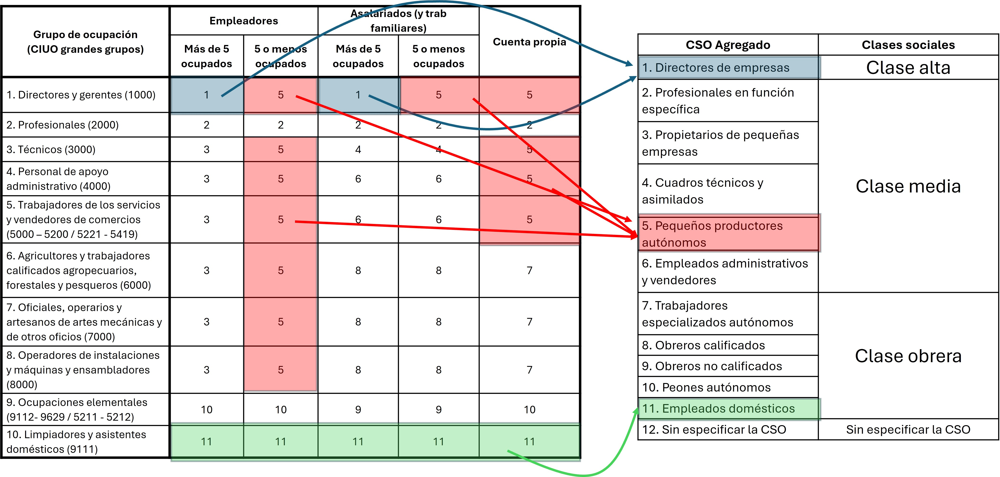
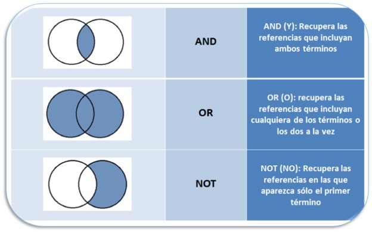
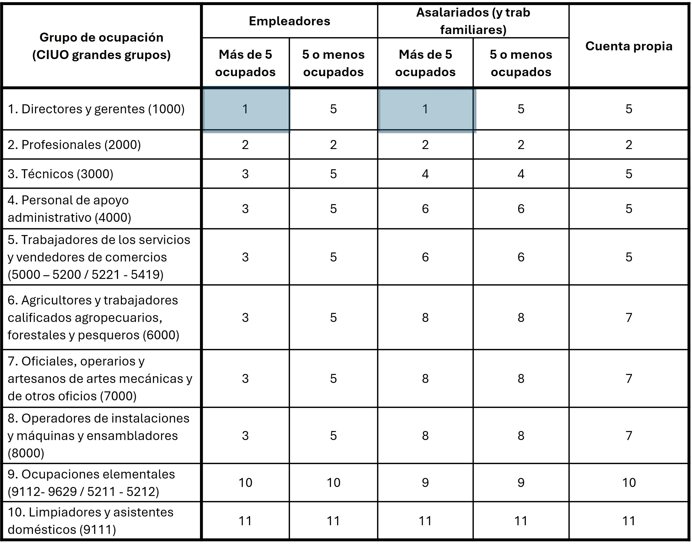
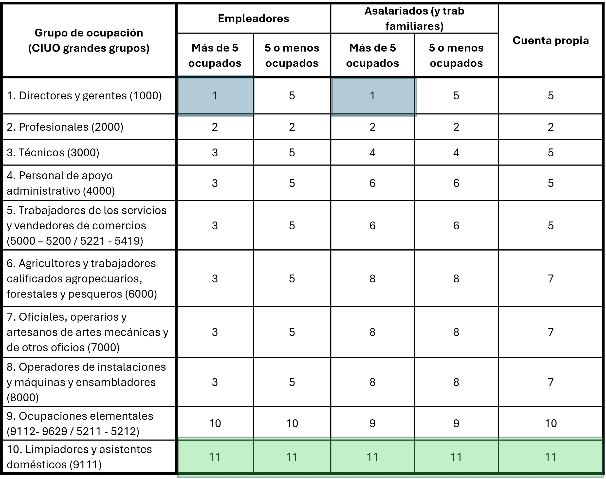
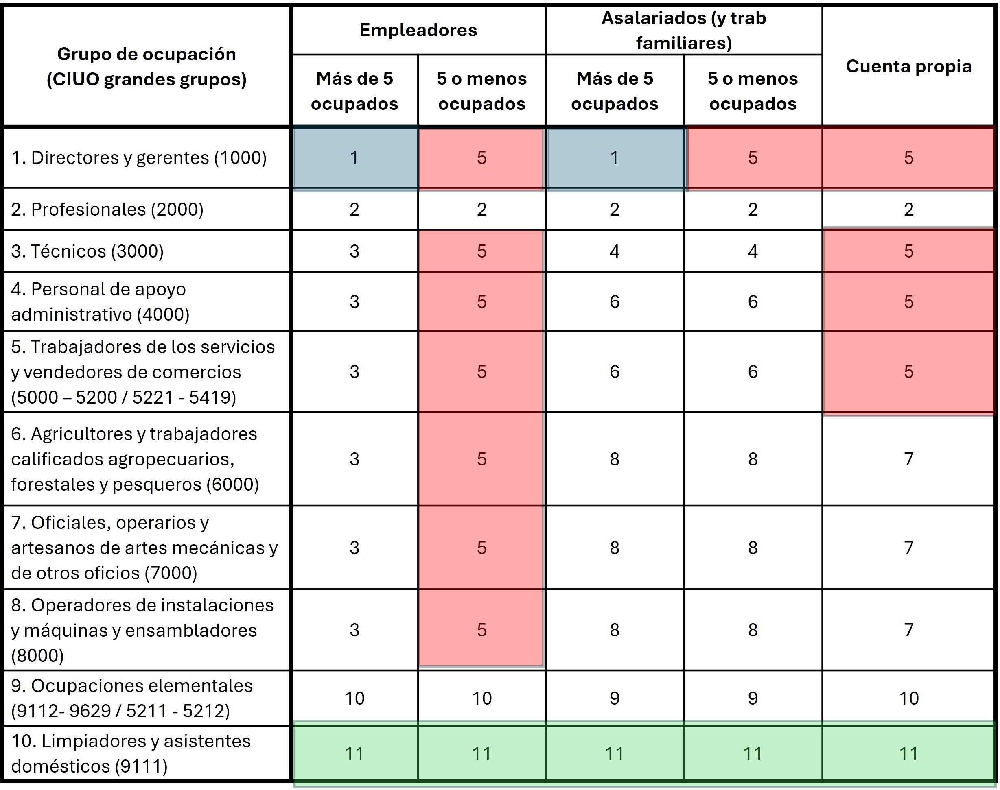

# Esquema de clases de Torrado  

En esta clase vamos a reconstruir el esquema de clases que construyó Susana Torrado -@Torrado1992a. No será una *traducción* exacta sino adaptación de su propuesta utilizando el **CIUO-08**. Tal como señalamos, el punto de partida para no perderse es la tabla de doble entrada en la que se cruzan las tres variables principales que utilizaremos: ocupación, categoría de ocupación y tamaño del establecimiento.  

```{r}
#| echo: false
#| label: fig-esquema
#| fig-cap: "Nuestra propuesta de operacionalización"
#| fig-align: "center"



```


## Librerías y base de datos  

```{r}
library(tidyverse)
library(haven)

base_esa <- read_sav("fuentes/base_esa_pisac.sav")
```


## Antes que nada... operadores lógicos  

A la hora de construir variables complejas como un esquema de clases es importante recordar cómo funcionan los operadores lógicos. En R, los operadores lógicos son: 
- `&` para "y" (AND)
- `|` para "o" (OR)
- `!` para "no" (NOT)

```{r}
#| echo: false
#| label: fig-op
#| fig-cap: "Operadores lógicos"
#| fig-align: "center"
#| out.width: "80%"



```


Los más utilizados serán el `&` y el `|`. Vamos a prácticar con un ejemplo práctico:  

| P(varón) | Q(>30) | p ∧ q (y) | p ∨ q (o) |
|:--------:|:------:|:---------:|:---------:|
| V        | V      | V         | V         |
| V        | F      | F         | V         |
| F        | V      | F         | V         |
| F        | F      | F         | F         |


## Operacionalizando paso a paso  

Antes de comenzar vamos a revisar las variables que tenemos que utilizar.  

- La ocupación se encuentra en la variable **CIUO_encuestado** y está codificada con el CIUO-08.  

- La categoría de ocupación se encuentra en la variable **M3.6** y están son sus categorías:  
  - **1** Empleadores
  - **2** Trabajadores por cuenta propia
  - **3** Trabajadores familiares no remunerados
  - **4** Trabajadores asalariados
  - **5** Servicio doméstico  
  
- El tamaño del establecimiento se encuentra en la variable **M3.6** y sus categorías son:  
  - **1** Una sola persona
  - **2** De 2 a 5 personas
  - **3** De 6 a 10 personas
  - **4** De 11 a 50 personas 
  - **5** De 51 a 200 personas
  - **6** Más de 200 personas
  - **99** Ns/Nc  
  
Empezemos por el estrato **1 Directores de empresas**. Según la @fig-esquema, dicho estrato comprende a:  
- todo el grupo 1000 del CIUO (*CIUO_encuestado >= 1000 & CIUO_encuestado < 2000*)  
- en establecimientos de más de 5 ocupados (*M3.6 >= 3*).  

Crearemos la variable **cso_torrado** para ir clasificando los casos y asignaremos con el valor 1 a la categoría de **Directores de empresas**.  

```{r}
base_esa <- base_esa %>% 
  mutate(cso_torrado = case_when(CIUO_encuestado >= 1000 & CIUO_encuestado < 2000 &
                                   M3.6 >= 3 ~ 1))
```


De este modo ya completamos dos casilleros de la tabla:   

```{r}
#| echo: false
#| label: fig-directivos
#| fig-cap: "Nuestra propuesta de operacionalización. Directivos de empresas"
#| fig-align: "center"
#| out.width: "60%"


```

Vamos ahora con el estrato **11 Empleadas domésticas**. En este caso pueden cumplirse dos condiciones de que tengan código 9111 en el CIUO (*CIUO_encuestado == 9111*).  


```{r}
base_esa <- base_esa %>% 
  mutate(cso_torrado = case_when(
    #Directivos de empresas
    CIUO_encuestado >= 1000 & CIUO_encuestado < 2000 &
                                   M3.6 >= 3 ~ 1, 
    # Empleadas domésticoas
    CIUO_encuestado == 9111 ~ 11))
```
 
De este modo ya completamos otros cinco casilleros de la tabla:  

```{r}
#| echo: false
#| label: fig-empleadas
#| fig-cap: "Nuestra propuesta de operacionalización. Empleadas domésticas"
#| fig-align: "center"
#| out.width: "60%"


```


El último grupo que vamos a tomar como ejemplo es el **5 Pequeños productores autónomos**. Este es el estrato más complejo, ya que diferentes combinaciones de categorías pueden tener como destino a dicho grupo. Debe considerarse a:  

- Directivos de empresas de 5 ocupados o menos  
- Trabajadores técnicos o calificados que son empleadores de establecimientos de menos de 5 ocupados   
- Trabajadores por cuenta propia no manuales calificados  

```{r}
base_esa <- base_esa %>% 
  mutate(cso_torrado = case_when(
    #Directivos de empresas
    CIUO_encuestado >= 1000 & CIUO_encuestado < 2000 &
                                   M3.6 >= 3 ~ 1, 
    # Empleadas domésticoas
    CIUO_encuestado == 9111 ~ 11, 
    # Pequeños productores autónomos
    (CIUO_encuestado >= 1000 & CIUO_encuestado < 2000 & M3.6 < 3) |
      (CIUO_encuestado >= 3000 & CIUO_encuestado < 9000 & M3.5 == 1 & M3.6 < 3) |
      (CIUO_encuestado >= 3000 & CIUO_encuestado < 5200 & M3.5 == 2) |
      (CIUO_encuestado >= 5200 & CIUO_encuestado < 6000 & M3.5 == 2) ~ 5))
```

De este modo ya completamos todos estos casilleros de la tabla:  

```{r}
#| echo: false
#| label: fig-pequenos
#| fig-cap: "Nuestra propuesta de operacionalización. Pequeños productores autónomos"
#| fig-align: "center"
#| out.width: "60%"


```


## Continuación de la operacionalización  

El resto de los estratos se pueden completar siguiendo la misma lógica. Para ello es necesario revisar el esquema de clases y traducir cada casillero utilizando operadores lógicos.  

```{r}
base_esa <- base_esa %>% 
  mutate(cso_torrado = case_when(
    
    # 1) Directores de empresas
    CIUO_encuestado >= 1000 & CIUO_encuestado < 2000 &
      M3.6 >= 3 ~ 1,
    
    # 2) Profesionales en función específica
    (CIUO_encuestado >= 2000 & CIUO_encuestado < 3000) |
      CIUO_encuestado == 110 |
      CIUO_encuestado == 210 ~ 2,
    
    # 3) Propietarios de pequeñas empresas
    CIUO_encuestado >= 3000 & CIUO_encuestado < 9000 &
      M3.5 == 1 & 
      M3.6 >= 3 ~ 3,
    
    # 4) Cuadros técnicos y asimilados
    CIUO_encuestado >= 3000 & CIUO_encuestado < 4000 &
      M3.5 >= 3 ~ 4,
    
    # 5) Pequeños productores autónomos
    (CIUO_encuestado >= 1000 & CIUO_encuestado < 2000 & M3.6 <= 2) |
      (CIUO_encuestado >= 3000 & CIUO_encuestado < 9000 & M3.5 == 1 & M3.6 <= 2) |
      (CIUO_encuestado >= 3000 & CIUO_encuestado < 5200 & M3.5 == 2) |
      (CIUO_encuestado >= 5220 & CIUO_encuestado < 6000 & M3.5 == 2) ~ 5,
    
    # 6) Empleados administrativos y vendedores
    (CIUO_encuestado >= 4000 & CIUO_encuestado < 5200 & M3.5 >= 3) |
      (CIUO_encuestado >= 5220 & CIUO_encuestado < 6000 & M3.5 >= 3) ~ 6,
    
    # 7) Trabajadores especializados autónomos
    CIUO_encuestado >= 6000 & CIUO_encuestado < 9000 &
      M3.5 == 2 ~ 7,
    
    # 8) Obreros calificados
    CIUO_encuestado >= 6000 & CIUO_encuestado < 9000 &
      M3.5 >= 3 ~ 8,
    
    # 9) Obreros no calificados
    (CIUO_encuestado > 9111 & CIUO_encuestado < 9999 & M3.5 >= 3) |
      (CIUO_encuestado >= 5200 & CIUO_encuestado < 5220 & M3.5 >= 3) |
      CIUO_encuestado == 310 ~ 9,
    
    # 10) Peones autónomos
    (CIUO_encuestado > 9111 & CIUO_encuestado < 9999 & M3.5 < 3) |
      (CIUO_encuestado >= 5200 & CIUO_encuestado < 5220 & M3.5 < 3) ~ 10,
    
    # 11) Empleados domésticos
    CIUO_encuestado == 9111 ~ 11
    
  )) 

```

Finalmente, para facilitar la interpretación de los resultados, vamos a convertir la variable **cso_torrado** en un factor con etiquetas. Llamaremos a esa variable **cso_torrado_f**.  

```{r}
base_esa <- base_esa %>% 
  mutate(cso_torrado_f = factor(cso_torrado,
                              levels = 1:11,
                              labels = c("Directores de empresas",
                                         "Profesionales en función específica",
                                         "Propietarios de pequeñas empresas",
                                         "Cuadros técnicos y asimilados",
                                         "Pequeños productores autónomos",
                                         "Empleados administrativos y comerciantes",
                                         "Trabajadores especializados autónomos",
                                         "Obreros calificados",
                                         "Obreros no calificados",
                                         "Peones autónomos",
                                         "Empleados domésticos")))
```

El esquema de clases agregado de Torrado -@Torrado1992a resulta de *colapsar* los estratos del CSO tal como se muestra en la @fig-esquema.  

```{r}
base_esa <- base_esa %>% 
  mutate(clase_torrado = case_when(cso_torrado == 1 ~ "Clase alta",
                                   cso_torrado %in% c(2:6) ~ "Clase media",
                                   cso_torrado %in% c(7:11) ~ "Clase obrera",
                                   TRUE ~ NA_character_))

base_esa <- base_esa %>% 
  mutate(clase_torrado_f = factor(clase_torrado,
                                  levels = c("Clase alta", "Clase media", "Clase obrera"),
                              labels = c("Clase alta", "Clase media", "Clase obrera")))
```

Sin embargo, los estratos pueden ordenarse de diversa forma. Desde la cátedra proponemos una recodificación distinta:  

```{r}
base_esa <- base_esa %>% 
  mutate(clase_torrado2 = case_when(
    
    # 1) Clase directivo-profesional (cso_torrado 1 y 2)
    cso_torrado %in% c(1, 2) ~ 1,
    
    # 2) Clase media rutinaria (cso_torrado 4 y 6)
    cso_torrado %in% c(4, 6) ~ 2,
    
    # 3) Pequeña burguesía (cso_torrado 3 y 5)
    cso_torrado %in% c(3, 5) ~ 3,
    
    # 4) Clase obrera calificada (cso_torrado 7 y 8)
    cso_torrado %in% c(7, 8) ~ 4,
    
    # 5) Clase obrera no calificada (cso_torrado 9, 10 y 11)
    cso_torrado %in% c(9, 10, 11) ~ 5,
    
    TRUE ~ NA_real_
    
  )) %>% 
  mutate(clase_torrado2_f = factor(clase_torrado2,
                                levels = 1:5,
                                labels = c("Clase directivo-profesional",
                                           "Clase media rutinaria",
                                           "Pequeña burguesía",
                                           "Clase obrera calificada",
                                           "Clase obrera no calificada")))
```


Si queremos rápidamente ver cómo quedaron clasificados los casos, podemos usar la función `table()` que profundizaremos la clase que viene.  

```{r}
table(base_esa$cso_torrado_f, useNA = "ifany")
```

Los casos **NA** corresponden, en su mayoría, a personas que fueron captadas como inactivas en la encuesta.  


# Librerías para automatizar el proceso  

Existen algunas librerías creadas por comunidades de usuarios que facilitan el proceso de creación de esquemas de clase o estratificación. Recomendamos la revisión de la librería `DIGCLASS` [@Cimentada.etal2026] cuyo objetivo es facilitar la traducción entre clases sociales ocupacionales. Facilita la traducción de la Clasificación Internacional Uniforme de Ocupaciones (CIUO) de 1968, 1988 y 2008 a una amplia gama de esquemas de clases sociales. En su [sitio web](https://digclass.pages.code.europa.eu/digclass/) pueden encontrar todas las funciones que presenta.  

Por ejemplo, podemos construir el índice ISEI (International Socio-Economic Index of Occupational Status). Este es un esqeuma basado en un enfoque gradacional, en donde a cada ocupación se le otorga un puntaje, estandarizado internacionalmente, considerando como factores a la edad, la educación y la ocupación. Lo que resulta de este índice es un ranking de ocupaciones.  

Para ello, aplicaremos la función `isco08_to_isei` para convertir cada código al ISEI.  

```{r eval=FALSE}
install.packages("DIGCLASS")
library(DIGCLASS)
```

```{r echo=FALSE}
library(DIGCLASS)
```


```{r}
base_esa <- base_esa %>% 
  mutate(isei = isco08_to_isei(CIUO_encuestado))
```

Si queremos ver como se distribuye la población según el ISEI:  

```{r}
table(base_esa$isei, useNA = "ifany")
```


