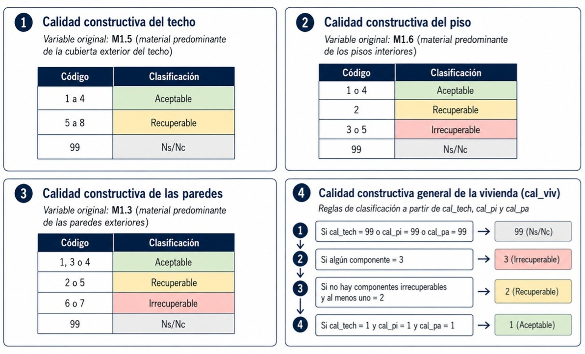
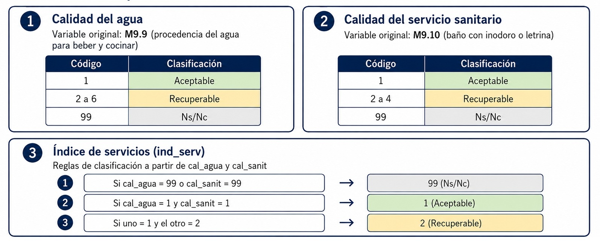
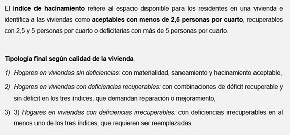
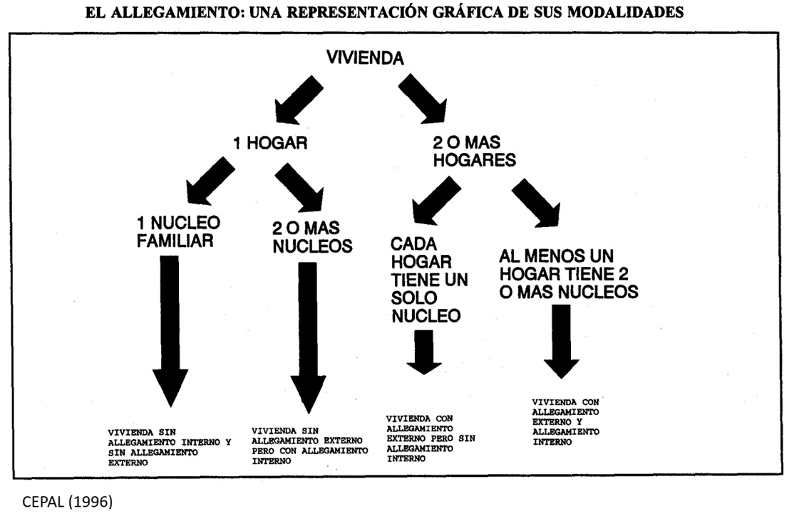

# Objetivo de la clase

Construir indicadores de déficit habitacional a partir de la Encuesta “Estructura social de Argentina y políticas públicas en tiempos del COVID-19” (PISAC-COVID), con el propósito de analizar sus diferencias según clase social.

## Bibliografia de consulta

CEPAL (1996) <https://repositorio.cepal.org/entities/publication/255dcf28-902c-4008-b498-4302fb648162>

Arriagada Luco (2003) <https://repositorio.cepal.org/entities/publication/58df5c1e-7c0b-425e-ba88-fabb2ef8876b>

Marcos et al (2018) <https://ri.conicet.gov.ar/handle/11336/176835>

Di Virgilio y Rodríguez (2018) <https://ri.conicet.gov.ar/handle/11336/177838>

Marcos et al (2022) <https://www.scielo.br/j/rbepop/a/CLjPSH4mNbm3PQ6BrmVNVkh/?format=html&lang=es>

# Deficit habitacional: definiciones

## Tipos de deficit


## Índice de materialidad de la vivienda



## Índice de servicios de la vivienda



## Hacinamiento y Tipología final de calidad de la vivienda



## Allegamiento



### Definiciones

**Hogar**: persona o grupo de personas que comparten gastos de alimentación).

**Núcleo conyugal**: a) pareja sin hijos, b) pareja con hijos o c) padre o madre con hijos.

Núcleo **primario**: nucleo conyugal que incluye al principal sostén del hogar (PSH).

Núcleo **secundario**: nucleo conyugal que no incluye a la PSH.

# Cálculo de indicadores

## Librerias y base

```{r}

# Instalar los paquetes una sola vez, luego solo se los llama cada vez que se ejecuta el programa
# install.packages(c("tidyverse", "haven", "openxlsx", "ggplot2", "data.table"))

library(tidyverse)  
library(haven)      
library(openxlsx)    
library(ggplot2)
library(data.table) 
library(writexl)

# Abrir la base de hogares
base_esa <- readRDS("fuentes/base_esa_pisac.rds")

# Abrir la base de componentes
base_componentes <- read_sav("fuentes/Base componentes.sav", encoding = "latin1")

```

## Diccionario de base

```{r}

# Con este bloque vamos a armar un excel que tenga una columna con el nombre de las variables y otra con la etiqueta. Sirve para buscar las variables que necesitemos.

diccionario_base_esa <- tibble(
                        #crea tabla
  variable = names(base_esa),
  #primera columna nombres de variables
  etiqueta = map_chr(base_esa, ~ paste(attr(.x, "label"), collapse = " | "))
)
  #recorre cada columna de la base, extrae etiqueta y colapsa todas las etiquetas que tenga en una sola columna


write_xlsx(
  diccionario_base_esa,
  "salidas/diccionario_base_esa.xlsx"
)
#guardamos diccionario
```

## Calidad de la vivienda: Indice de materialidad

```{r}

# 1. Crear indicadores de calidad de la vivienda (techo, piso y pared)

base_esa <- base_esa %>% 
  mutate(
    # Calidad constructiva del techo
    # Variable original: M1_5
    # Pregunta: material predominante de la cubierta exterior del techo
    #
    # 1 a 4  = aceptable
    # 5 a 8  = recuperable
    # 99     = Ns/Nc

    cal_tech = case_when(
      M1.5 %in% 1:4 ~ 1, #es lo mismo que: "M1.5 >= 1 & M1.5 >= 4", pero más corto
      M1.5 %in% 5:8 ~ 2,
      M1.5 == 99    ~ 99,
      TRUE          ~ NA_real_
    ),
    
    # Calidad constructiva del piso
    # Variable original: M1_6
    # Pregunta: material predominante de los pisos interiores
    #
    # 1 o 4  = aceptable
    # 2      = recuperable
    # 3 o 5  = irrecuperable
    # 99     = Ns/Nc
    cal_pi = case_when(
      M1.6 %in% c(1, 4) ~ 1,
      M1.6 == 2         ~ 2,
      M1.6 %in% c(3, 5) ~ 3,
      M1.6 == 99        ~ 99,
      TRUE              ~ NA_real_
    ),
    
    # Calidad constructiva de las paredes
    # Variable original: M1_3
    # Pregunta: material predominante de las paredes exteriores
    #
    # 1, 3 o 4 = aceptable
    # 2 o 5    = recuperable
    # 6 o 7    = irrecuperable
    # 99       = Ns/Nc
    cal_pa = case_when(
      M1.3 %in% c(1, 3, 4) ~ 1,
      M1.3 %in% c(2, 5)    ~ 2,
      M1.3 %in% c(6, 7)    ~ 3,
      M1.3 == 99           ~ 99,
      TRUE                 ~ NA_real_
    ),
    
    # Calidad constructiva general de la vivienda
    #
    # Regla:
    # - Si algún componente es irrecuperable, la vivienda es irrecuperable.
    # - Si no hay componentes irrecuperables, pero al menos uno es recuperable,
    #   la vivienda es recuperable.
    # - Si todos los componentes son aceptables, la vivienda es aceptable.
    # - Si no se puede clasificar por falta de información, se conserva 99.
    
    cal_viv = case_when(
      cal_tech == 99 | cal_pi == 99 | cal_pa == 99 ~ 99,
      cal_tech == 3 | cal_pi == 3 | cal_pa == 3 ~ 3,
      cal_tech == 2 | cal_pi == 2 | cal_pa == 2 ~ 2,
      cal_tech == 1 & cal_pi == 1 & cal_pa == 1 ~ 1,
      TRUE ~ NA_real_
    )
  )

# 2. Cruces de control 

tabla_cal_viv_1 <- base_esa %>% 
  filter(cal_viv == 1) %>% 
  count(cal_tech, cal_pi, cal_pa)

tabla_cal_viv_1

tabla_cal_viv_2 <- base_esa %>% 
  filter(cal_viv == 2) %>% 
  count(cal_tech, cal_pi, cal_pa)

tabla_cal_viv_2

tabla_cal_viv_3 <- base_esa %>% 
  filter(cal_viv == 3) %>% 
  count(cal_tech, cal_pi, cal_pa)

tabla_cal_viv_3

tabla_cal_viv_99 <- base_esa %>% 
  filter(cal_viv == 99) %>% 
  count(cal_tech, cal_pi, cal_pa)

tabla_cal_viv_99
```

## Calidad de la vivienda: Indice de servicios

```{r}

# 1. Crear indicadores de calidad de servicios de la vivienda

base_esa <- base_esa %>% 
  mutate(
    # Calidad del agua
    # Variable original: M9.9
    # Pregunta: procedencia del agua
    #
    # 1      = aceptable
    # 2 a 6  = recuperable
    # 99     = Ns/Nc
    
    cal_agua = case_when(
      M9.9 == 1     ~ 1,
      M9.9 %in% 2:6 ~ 2,
      M9.9 == 99    ~ 99,
      TRUE          ~ NA_real_
    ),
    
    # Calidad del servicio sanitario
    # Variable original: M9.10
    # Pregunta: baño con inodoro o letrina
    #
    # 1      = aceptable
    # 2 a 4  = recuperable
    # 99     = Ns/Nc
    cal_sanit = case_when(
      M9.10 == 1      ~ 1,
      M9.10 %in% 2:4  ~ 2,
      M1.6 == 99      ~ 99,
      TRUE            ~ NA_real_
    ),
    
    # Calidad general de servicios
    #
    # Regla:
    # - Si no se puede clasificar por falta de información, se conserva 99.
    # - Si todos los componentes son aceptables, la vivienda es aceptable.
    # - Si un componente es recuperable y otro aceptable, se asigna recuperable.

    cal_serv = case_when(
      cal_agua == 99 | cal_sanit == 99 ~ 99,
      cal_agua == 1 & cal_sanit == 1 ~ 1,
      (cal_agua == 2 & cal_sanit == 1) | (cal_agua == 1 & cal_sanit == 2)~ 2,
      TRUE ~ NA_real_
    )
  )

# 2. Cruces de control 

tabla_cal_serv_1 <- base_esa %>% 
  filter(cal_serv == 1) %>% 
  count(cal_agua, cal_sanit)

tabla_cal_serv_1

tabla_cal_serv_2 <- base_esa %>% 
  filter(cal_serv == 2) %>% 
  count(cal_agua, cal_sanit)

tabla_cal_serv_2

tabla_cal_serv_99 <- base_esa %>% 
  filter(cal_serv == 99) %>% 
  count(cal_agua, cal_sanit)

tabla_cal_serv_99
```

## Hacinamiento

```{r}

base_esa <- base_esa %>% 
  mutate(
    miembros_cuartos = MIEMBROS / M9.4,
    
    hacina = case_when(
      miembros_cuartos < 2.5 ~ 1,
      miembros_cuartos >= 2.5 & miembros_cuartos <= 5 ~ 2,
      miembros_cuartos > 5 ~ 3,
    ))
    
# Tablas de control 

tabla_hacina1 <- base_esa %>% 
  count(miembros_cuartos,MIEMBROS,M9.4)

tabla_hacina2 <- base_esa %>% 
  count(miembros_cuartos,hacina)

```

## Allegamiento

```{r}

# 1. Allegamiento externo

# Hay un solo hogar por vivienda con lo cual no se calcula el allegamiento externo (más de un hogar por vivienda).


# 2. Allegamiento interno
# a. Tomar la base de componentes para recuperar los parentescos en cada hogar (jefe, hijo, conyuge, nuera, etc.)

# b. Contar cantidad de personas segun relacion o parentesco
# Para eso debo agrupar la base por hogares (mismo CUEST)

base_componentes_agre <- base_componentes %>%
  group_by(CUEST) %>%
  summarise(
    
    # Cantidad de yernos o nueras en el hogar
    yerno_nuera = sum(`M2.5` == 5, na.rm = TRUE),
    
    # Cantidad de nietos/as en el hogar
    nietes = sum(`M2.5` == 7, na.rm = TRUE),
    
    # Cantidad de hijos/as o hijastros/as mayores de 17 años
    hijes_may17 = sum(`M2.5` %in% c(3, 4) & `M2.4` >= 18 & `M2.4` < 999, na.rm = TRUE),
    
    # Cantidad de padres, madres, suegros o suegras
    pad_sueg = sum(`M2.5` == 8, na.rm = TRUE),
    
    # Cantidad de hermanos/as
    hermanos = sum(`M2.5` == 6, na.rm = TRUE),
    
    # Cantidad de otros parientes u otras personas
    otros = sum(`M2.5` == 666666, na.rm = TRUE),
    
    .groups = "drop"
  )


# c. Contar cantidad de nucleos secundarios

base_componentes_agre <- base_componentes_agre %>%
  mutate(
    
    # Núcleos formados por hijos/as mayores de 17 años con nietos/as
    # Contar un nucleo por cada par de hijo + nieto
    nuc_hijes_nietes = pmin(hijes_may17, nietes),
    # de esta manera contamos la cantidad mínima comparando cantidad de hijos y nietos en cada hogar
    
    # Núcleos de padres/suegros
    nuc_padsueg = case_when(
      pad_sueg == 2 ~ 1,
      pad_sueg == 3 ~ 1,
      pad_sueg >= 4 ~ 2,
      TRUE ~ 0
    ),
    
    # Núcleos de hermanos/as
    nuc_hermanos = case_when(
      hermanos == 2 ~ 1,
      hermanos == 3 ~ 1,
      hermanos >= 4 ~ 2,
      TRUE ~ 0
    ),
    
    # Núcleos de otros
    nuc_otros = case_when(
      otros == 2 ~ 1,
      otros == 3 ~ 1,
      otros >= 4 ~ 2,
      TRUE ~ 0
    )
  )

# d. Sumar los nucleos secundarios por hogar

base_componentes_agre <- base_componentes_agre %>%
  mutate(
    tot_nuc_sec =
      yerno_nuera +
      nuc_hijes_nietes +
      nuc_padsueg +
      nuc_hermanos +
      nuc_otros
  )

# e. Construimos variable de allegamiento

base_componentes_agre <- base_componentes_agre %>%
  mutate(
    allega = case_when(
      tot_nuc_sec >= 1 ~ 2,
      TRUE ~ 1
    )
  )
```

## Clase del PSH

### Estratos

```{r}

base_esa <- base_esa %>% 
  mutate(cso_torrado_PSH = case_when(
    
    # 1) Directores de empresas
    CIUO_PSH >= 1000 & CIUO_PSH < 2000 &
      M3.6 >= 3 ~ 1,
    
    # 2) Profesionales en función específica
    (CIUO_PSH >= 2000 & CIUO_PSH < 3000) |
      CIUO_PSH == 110 |
      CIUO_PSH == 210 ~ 2,
    
    # 3) Propietarios de pequeñas empresas
    CIUO_PSH >= 3000 & CIUO_PSH < 9000 &
      M3.5 == 1 & 
      M3.6 >= 3 ~ 3,
    
    # 4) Cuadros técnicos y asimilados
    CIUO_PSH >= 3000 & CIUO_PSH < 4000 &
      M3.5 >= 3 ~ 4,
    
    # 5) Pequeños productores autónomos
    (CIUO_PSH >= 1000 & CIUO_PSH < 2000 & M3.6 <= 2) |
      (CIUO_PSH >= 3000 & CIUO_PSH < 9000 & M3.5 == 1 & M3.6 <= 2) |
      (CIUO_PSH >= 3000 & CIUO_PSH < 5200 & M3.5 == 2) |
      (CIUO_PSH >= 5220 & CIUO_PSH < 6000 & M3.5 == 2) ~ 5,
    
    # 6) Empleados administrativos y vendedores
    (CIUO_PSH >= 4000 & CIUO_PSH < 5200 & M3.5 >= 3) |
      (CIUO_PSH >= 5220 & CIUO_PSH < 6000 & M3.5 >= 3) ~ 6,
    
    # 7) Trabajadores especializados autónomos
    CIUO_PSH >= 6000 & CIUO_PSH < 9000 &
      M3.5 == 2 ~ 7,
    
    # 8) Obreros calificados
    CIUO_PSH >= 6000 & CIUO_PSH < 9000 &
      M3.5 >= 3 ~ 8,
    
    # 9) Obreros no calificados
    (CIUO_PSH > 9111 & CIUO_PSH < 9999 & M3.5 >= 3) |
      (CIUO_PSH >= 5200 & CIUO_PSH < 5220 & M3.5 >= 3) |
      CIUO_PSH == 310 ~ 9,
    
    # 10) Peones autónomos
    (CIUO_PSH > 9111 & CIUO_PSH < 9999 & M3.5 < 3) |
      (CIUO_PSH >= 5200 & CIUO_PSH < 5220 & M3.5 < 3) ~ 10,
    
    # 11) Empleados domésticos
    CIUO_PSH == 9111 ~ 11
    
  ))

```

### Convertir la variable **cso_torrado** en un factor con etiquetas

```{r}

base_esa <- base_esa %>% 
  mutate(
    cso_torrado_PSH_f = 
      factor(cso_torrado_PSH, 
                levels = 1:11, 
                labels = c("Directores de empresas",
                           "Profesionales en función específica",
                           "Propietarios de pequeñas empresas",
                           "Cuadros técnicos y asimilados",
                           "Pequeños productores autónomos",
                           "Empleados administrativos y comerciantes",
                           "Trabajadores especializados autónomos",
                           "Obreros calificados",
                           "Obreros no calificados",
                           "Peones autónomos",
                           "Empleados domésticos")))
```

### Propuesta de recodificación

```{r}

base_esa <- base_esa %>% 
  mutate(clase_torrado_PSH = case_when(
    
    # 1) Clase directivo-profesional (cso_torrado 1 y 2)
    cso_torrado_PSH %in% c(1, 2) ~ 1,
    
    # 2) Clase media rutinaria (cso_torrado 4 y 6)
    cso_torrado_PSH %in% c(4, 6) ~ 2,
    
    # 3) Pequeña burguesía (cso_torrado 3 y 5)
    cso_torrado_PSH %in% c(3, 5) ~ 3,
    
    # 4) Clase obrera calificada (cso_torrado 7 y 8)
    cso_torrado_PSH %in% c(7, 8) ~ 4,
    
    # 5) Clase obrera no calificada (cso_torrado 9, 10 y 11)
    cso_torrado_PSH %in% c(9, 10, 11) ~ 5,
    
    TRUE ~ NA_real_
    
  )) %>% 
  mutate(clase_torrado_PSH_f = factor(clase_torrado_PSH,
                                levels = 1:5,
                                labels = c("Directiva-\nprofesional",
                                             "Media\nrutinaria",
                                             "Pequeña\nburguesía",
                                             "Obrera\ncalificada",
                                             "Obrera\nnocalificada")))
```

## Unir las bases de hogar y componentes

```{r}

# 1. Seleccionar las variables de interés: Calidad de la vivienda, Clase del Jefe y Ponderadores

base_esa_sel <- base_esa %>%
  select(
    CUEST,
    cal_tech,
    cal_pi,
    cal_pa,
    cal_viv,
    cal_serv,
    hacina,
    cso_torrado_PSH,
    clase_torrado_PSH,
    clase_torrado_PSH_f,
    POND2R_FIN_n,
    POND2R_FIN,
    POND1R_FIN_n,
    POND1R_FIN
  )

base_componentes_agre_sel <- base_componentes_agre %>% 
  select(
    CUEST,
    tot_nuc_sec,
    allega)

# 2. Unir las bases
base_hogares <- base_esa_sel %>%
  left_join(base_componentes_agre_sel, by = "CUEST")

#left_join() mantiene todos los casos de la primera base ("base_hogares") y le agrega las variables de la segunda base ("base_esa_s"), usando una variable común para unirlas (CUEST).

```

## Tablas

```{r}

# 1. Para facilitar interpretacion de tabla convertimos primero las variables en factores con etiquetas

base_hogares <- base_hogares %>% 
  mutate(allega = factor(allega,
                                levels = 1:2,
                                labels = c("Sin allegamiento",
                                           "Con allegamiento")))

base_hogares <- base_hogares %>% 
   mutate(cal_viv = factor(cal_viv,
                                  levels =  1:4,
                                  labels = c("aceptable",
                                             "recuperable",
                                             "irrecuperable",
                                             "sin información")))

base_hogares <- base_hogares %>% 
  mutate(cal_serv = factor(cal_serv,
                          levels =  1:3,
                          labels = c("aceptable",
                                     "recuperable",
                                     "sin información")))

base_hogares <- base_hogares %>% 
  mutate(hacina = factor(hacina,
                           levels =  1:3,
                           labels = c("aceptable",
                                      "recuperable",
                                      "deficitario")))
                         
# 2. Tablas

# xtabs() arma una tabla cruzada.
# A la izquierda de ~ ponemos el ponderador.
# A la derecha ponemos las variables que queremos cruzar.

# a. Tabla de Calidad de vivienda y Clase

tabla_calviv_cso_pond <- xtabs(
  POND2R_FIN_n ~ cal_viv + clase_torrado_PSH_f,
  data = base_hogares
)

tabla_calviv_cso_pond

# b. Tabla de Calidad de servicios y Clase

tabla_cal_serv_cso_pond <- xtabs(
  POND2R_FIN_n ~ cal_serv + clase_torrado_PSH_f,
  data = base_hogares
)

tabla_cal_serv_cso_pond

# c. Tabla de Hacinamiento y Clase

tabla_hacina_cso_pond <- xtabs(
  POND2R_FIN_n ~ hacina + clase_torrado_PSH_f,
  data = base_hogares
)

tabla_hacina_cso_pond

# d. Tabla de Allegamiento y Clase

tabla_allega_cso_pond <- xtabs(
  POND2R_FIN_n ~ allega + clase_torrado_PSH_f,
  data = base_hogares
)

tabla_allega_cso_pond

# Exportar las tablas a excel

write.xlsx(
  tabla_calviv_cso_pond,
  file = "salidas/tabla_calviv_cso_pond.xlsx",
  overwrite = TRUE
)

write.xlsx(
  tabla_hacina_cso_pond,
  file = "salidas/tabla_calviv_cso_pond.xlsx",
  overwrite = TRUE
)

write.xlsx(
  tabla_allega_cso_pond,
  file = "salidas/tabla_allega_cso_pond.xlsx",
  overwrite = TRUE
)
```

## Gráfico

```{r}

# Tabla para el gráfico: porcentaje de calidad de vivienda por clase

tabla_grafico_cal_viv <- base_hogares %>% 
  filter(!is.na(cal_viv) & !is.na(clase_torrado_PSH_f)) %>% 
  group_by(clase_torrado_PSH_f, cal_viv) %>% 
  summarise(
    total = sum(POND2R_FIN_n, na.rm = TRUE),
    .groups = "drop"
  ) %>% 
  group_by(clase_torrado_PSH_f) %>% 
  mutate(
    porcentaje = total / sum(total) * 100
  )


# Gráfico de barras porcentuales

grafico_cal_viv <- ggplot(
  tabla_grafico_cal_viv,
  aes(x = clase_torrado_PSH_f, y = porcentaje, fill = cal_viv)) +
  geom_col() +
  geom_text(
    aes(label = round(porcentaje, 1)),
    position = position_stack(vjust = 0.5),
    size = 3) +
  scale_fill_manual(
    values = c(
      "aceptable" = "#7FAF3A",
      "recuperable" = "#F2C94C",
      "irrecuperable" = "#C94C3C")) +
      labs(
        x = "Clase social",
        y = "%",
        fill = "Calidad de la vivienda")

grafico_cal_viv


ggsave(
  filename = "salidas/grafico_calidad_vivienda_clase.jpg",
  plot = grafico_cal_viv,
  dpi = 300,
  width = 8,
  height = 5
)
```
