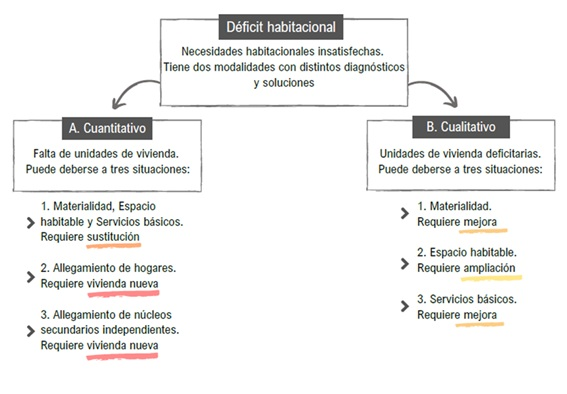

## Objetivo de la clase

Construir, con la base PISAC-COVID, indicadores de **déficit habitacional** para analizar diferenciales entre las **clases sociales**.

**Bibliografia de consulta**

CEPAL (1996) <https://repositorio.cepal.org/entities/publication/255dcf28-902c-4008-b498-4302fb648162>

Arriagada Luco (2003) <https://repositorio.cepal.org/entities/publication/58df5c1e-7c0b-425e-ba88-fabb2ef8876b>

Marcos et al (2018) <https://ri.conicet.gov.ar/handle/11336/176835>

Marcos et al (2022) <https://www.scielo.br/j/rbepop/a/CLjPSH4mNbm3PQ6BrmVNVkh/?format=html&lang=es>

## Déficit habitacional: consideraciones generales
### Tipos de déficit



A1 + B1 + B2 + B3: Calidad de la vivienda \| A2 + A3: Allegamiento

### Indice de materialidad de la vivienda


### Indice de servicios de la vivienda


### Hacinamiento y tipología final


## Librerias y base

```{r setup}

# Instalar una sola vez los paquetes, luego solo se los llama cada vez que se ejecuta el programa:
# install.packages(c("tidyverse", "haven", "openxlsx", "ggplot2", "data.table"))

library(tidyverse)  
library(haven)      
library(openxlsx)    
library(ggplot2)
library(data.table) 


base_esa <- readRDS("fuentes/base_esa_pisac.rds")

```

## Calidad de la vivienda: Indice de materialidad

```{r}

# 1. Crear indicadores de calidad de la vivienda (techo, piso y pared)

base_esa <- base_esa %>% 
  mutate(
    # Calidad constructiva del techo
    # Variable original: M1_5
    # Pregunta: material predominante de la cubierta exterior del techo
    #
    # 1 a 4  = aceptable
    # 5 a 8  = recuperable
    # 99     = Ns/Nc

    cal_tech = case_when(
      M1.5 %in% 1:4 ~ 1, #es lo mismo que: "M1.5 >= 1 & M1.5 >= 4", pero más corto
      M1.5 %in% 5:8 ~ 2,
      M1.5 == 99    ~ 99,
      TRUE          ~ NA_real_
    ),
    
    # Calidad constructiva del piso
    # Variable original: M1_6
    # Pregunta: material predominante de los pisos interiores
    #
    # 1 o 4  = aceptable
    # 2      = recuperable
    # 3 o 5  = irrecuperable
    # 99     = Ns/Nc
    cal_pi = case_when(
      M1.6 %in% c(1, 4) ~ 1,
      M1.6 == 2         ~ 2,
      M1.6 %in% c(3, 5) ~ 3,
      M1.6 == 99        ~ 99,
      TRUE              ~ NA_real_
    ),
    
    # Calidad constructiva de las paredes
    # Variable original: M1_3
    # Pregunta: material predominante de las paredes exteriores
    #
    # 1, 3 o 4 = aceptable
    # 2 o 5    = recuperable
    # 6 o 7    = irrecuperable
    # 99       = Ns/Nc
    cal_pa = case_when(
      M1.3 %in% c(1, 3, 4) ~ 1,
      M1.3 %in% c(2, 5)    ~ 2,
      M1.3 %in% c(6, 7)    ~ 3,
      M1.3 == 99           ~ 99,
      TRUE                 ~ NA_real_
    ),
    
    # Calidad constructiva general de la vivienda
    #
    # Regla:
    # - Si algún componente es irrecuperable, la vivienda es irrecuperable.
    # - Si no hay componentes irrecuperables, pero al menos uno es recuperable,
    #   la vivienda es recuperable.
    # - Si todos los componentes son aceptables, la vivienda es aceptable.
    # - Si no se puede clasificar por falta de información, se conserva 99.
    
    cal_viv = case_when(
      cal_tech == 99 | cal_pi == 99 | cal_pa == 99 ~ 99,
      cal_tech == 3 | cal_pi == 3 | cal_pa == 3 ~ 3,
      cal_tech == 2 | cal_pi == 2 | cal_pa == 2 ~ 2,
      cal_tech == 1 & cal_pi == 1 & cal_pa == 1 ~ 1,
      TRUE ~ NA_real_
    )
  )

# 2. Cruces de control 

tabla_cal_viv_1 <- base_esa %>% 
  filter(cal_viv == 1) %>% 
  count(cal_tech, cal_pi, cal_pa)

tabla_cal_viv_1

tabla_cal_viv_2 <- base_esa %>% 
  filter(cal_viv == 2) %>% 
  count(cal_tech, cal_pi, cal_pa)

tabla_cal_viv_2

tabla_cal_viv_3 <- base_esa %>% 
  filter(cal_viv == 3) %>% 
  count(cal_tech, cal_pi, cal_pa)

tabla_cal_viv_3

tabla_cal_viv_99 <- base_esa %>% 
  filter(cal_viv == 99) %>% 
  count(cal_tech, cal_pi, cal_pa)

tabla_cal_viv_99
```

## Calidad de la vivienda: Indice de servicios
```{r}


```

## Calidad general de la vivienda
```{r}


```


## Allegamiento

```{r}

# 1. Allegamiento externo

# Hay un solo hogar por vivienda con lo cual no se calcula el allegamiento externo (más de un hogar por vivienda).


# 2. Allegamiento interno
# a. Abrir la base de componentes para recuperar los parentescos en cada hogar (jefe, hijo, conyuge, nuera, etc.)

base_componentes <- read_sav("fuentes/Base componentes.sav", 
                             encoding = "latin1")

# b. Contar cantidad de personas segun relacion o parentesco

base_hogares <- base_componentes %>%
  group_by(CUEST) %>%
  summarise(
    
    # Cantidad de yernos o nueras en el hogar
    yerno_nuera = sum(`M2.5` == 5, na.rm = TRUE),
    
    # Cantidad de nietos/as en el hogar
    nietes = sum(`M2.5` == 7, na.rm = TRUE),
    
    # Cantidad de hijos/as o hijastros/as mayores de 17 años
    hijes_may17 = sum(`M2.5` %in% c(3, 4) & `M2.4` >= 18 & `M2.4` < 999, na.rm = TRUE),
    
    # Cantidad de padres, madres, suegros o suegras
    pad_sueg = sum(`M2.5` == 8, na.rm = TRUE),
    
    # Cantidad de hermanos/as
    hermanos = sum(`M2.5` == 6, na.rm = TRUE),
    
    # Cantidad de otros parientes u otras personas
    otros = sum(`M2.5` == 666666, na.rm = TRUE),
    
    .groups = "drop"
  )


# c. Contar cantidad de nucleos secundarios

base_hogares <- base_hogares %>%
  mutate(
    
    # Núcleos formados por hijos/as mayores de 17 años con nietos/as
    # Contar un nucleo por cada par de hijo + nieto
    nuc_hijes_nietes = pmin(hijes_may17, nietes),
    # de esta manera contamos la cantidad mínima comparando cantidad de hijos y nietos en cada hogar
    
    # Núcleos de padres/suegros
    nuc_padsueg = case_when(
      pad_sueg == 2 ~ 1,
      pad_sueg == 3 ~ 1,
      pad_sueg >= 4 ~ 2,
      TRUE ~ 0
    ),
    
    # Núcleos de hermanos/as
    nuc_hermanos = case_when(
      hermanos == 2 ~ 1,
      hermanos == 3 ~ 1,
      hermanos >= 4 ~ 2,
      TRUE ~ 0
    ),
    
    # Núcleos de otros
    nuc_otros = case_when(
      otros == 2 ~ 1,
      otros == 3 ~ 1,
      otros >= 4 ~ 2,
      TRUE ~ 0
    )
  )

# d. Sumar los nucleos secundarios por hogar

base_hogares <- base_hogares %>%
  mutate(
    tot_nuc_sec =
      yerno_nuera +
      nuc_hijes_nietes +
      nuc_padsueg +
      nuc_hermanos +
      nuc_otros
  )

# e. Construimos variable de allegamiento

base_hogares <- base_hogares %>%
  mutate(
    allega = case_when(
      tot_nuc_sec >= 1 ~ 2,
      TRUE ~ 1
    )
  )
```

## Unir Calidad y Allegamiento en una misma base

```{r}

# 1. Seleccionar las variables de interés: Calidad de la vivienda, Clase del Jefe y Ponderadores

base_esa_s <- base_esa %>%
  select(
    CUEST,
    cal_tech,
    cal_pi,
    cal_pa,
    cal_viv,
    cso_torrado,
    clase_torrado,
    clase_torrado_f,
    POND2R_FIN_n,
    POND2R_FIN,
    POND1R_FIN_n,
    POND1R_FIN
  )

# 2. Unir las bases
base_hogares <- base_hogares %>%
  left_join(base_esa_s, by = "CUEST")

#left_join() mantiene todos los casos de la primera base ("base_hogares") y le agrega las variables de la segunda base ("base_esa_s"), usando una variable común para unirlas (CUEST).

```

## Tablas

```{r}

# 1. Para facilitar interpretacion de tabla convertimos primero las variables en factores con etiquetas

base_hogares <- base_hogares %>% 
  mutate(allega = factor(allega,
                                levels = 1:2,
                                labels = c("Sin allegamiento",
                                           "Con allegamiento")))

base_hogares <- base_hogares %>% 
   mutate(cal_viv = factor(cal_viv,
                                  levels =  1:4,
                                  labels = c("aceptable",
                                             "recuperable",
                                             "irrecuperable",
                                             "sin información")))
                         
# 2. Tablas

# xtabs() arma una tabla cruzada.
# A la izquierda de ~ ponemos el ponderador.
# A la derecha ponemos las variables que queremos cruzar.

# a. Tabla de Calidad de vivienda y Clase

tabla_calviv_cso_pond <- xtabs(
  POND2R_FIN_n ~ cal_viv + clase_torrado_f,
  data = base_hogares
)

tabla_calviv_cso_pond

# Tb. abla de Allegamiento y Clase

tabla_allega_cso_pond <- xtabs(
  POND2R_FIN_n ~ allega + clase_torrado_f,
  data = base_hogares
)

tabla_allega_cso_pond

# Exportar las tablas a excel

write.xlsx(
  tabla_calviv_cso_pond,
  file = "salidas/tabla_calviv_cso_pond.xlsx",
  overwrite = TRUE
)

write.xlsx(
  tabla_allega_cso_pond,
  file = "salidas/tabla_allega_cso_pond.xlsx",
  overwrite = TRUE
)
```

## Gráfico

```{r}


```
